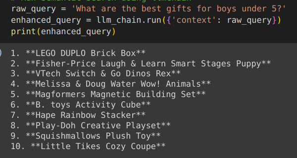
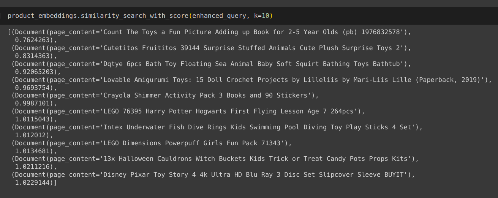

# Semantic Search for Online Marketplace

This project implements a semantic search for an online marketplace, addressing the challenge of assisting **users who may not have a specific product in mind.** Leveraging advanced techniques in natural language processing and vectorization, the system generates a list of similar products to aid users in discovering items that align with their preferences, even when they are unsure about what they are looking for.

## How It Works

### 1. Semantic Vectorization

The core functionality of the system relies on the conversion of product descriptions into vectors. This process is facilitated by the Faiss library, a powerful tool for efficient similarity search and clustering of dense vectors. Each product in the database is represented as a vector, capturing its semantic features and characteristics.

### 2. Palm LLM for Item Generation

To enhance the quality of the generated list of similar products, the system employs the Palm LLM (Language Model) for item generation. The language model helps in understanding the context and semantics of the user query, allowing for more accurate and relevant recommendations.

### 3. Installation and Configuration

To set up and run the project, follow these steps:

1. **Requirements Installation:**
   - Install the required dependencies by running `pip install -r requirements.txt`.

2. **Environment Variable Setup:**
   - Set up your Google API key as an environment variable named `GOOGLE_API_KEY` to enable the Palm LLM functionality.

3. **Database Integration:**
   - Integrate your product database with the Faiss library for semantic vectorization.

4. **Run the System:**
   - Execute the main script to start the semantic search system.

```bash
python main.py
```

## Project Structure

The project is organized into two main files:

### 1. `langchain_helper.py`

This module contains the core functionality for semantic search. It defines a function `run_semantic_search()` that performs semantic search based on user input. The improvements include error handling, input validation, logging, and separation of concerns.

### 2. `main.py`

The main script imports the `run_semantic_search` function from `my_module.py` and executes it. The script handles the results and displays them as needed. It includes a try-except block for better error handling.

## Usage

To run the semantic search, execute the `main.py` script and follow the prompts. The system will provide a curated list of similar products based on the user's input.

## Screenshots

### 1. Product List


*Caption: Screenshot showing the list of products generated from LLM to be searched on the online marketplace.*

### 2. Semantically Similar Items


*Caption: Screenshot demonstrating the semantically similar items generated by the system based on the user query.*

## Contribution Guidelines

Contributions from the community are welcome. If you find any issues or have ideas for improvements, please open an issue or submit a pull request.

## License

This project is licensed under the [MIT License](LICENSE).

## Acknowledgments

- The developers and contributors of the Faiss library and Palm LLM for providing powerful tools that enable advanced semantic search functionality.
- The open-source community for their continuous support and contributions.

Happy Learning :)